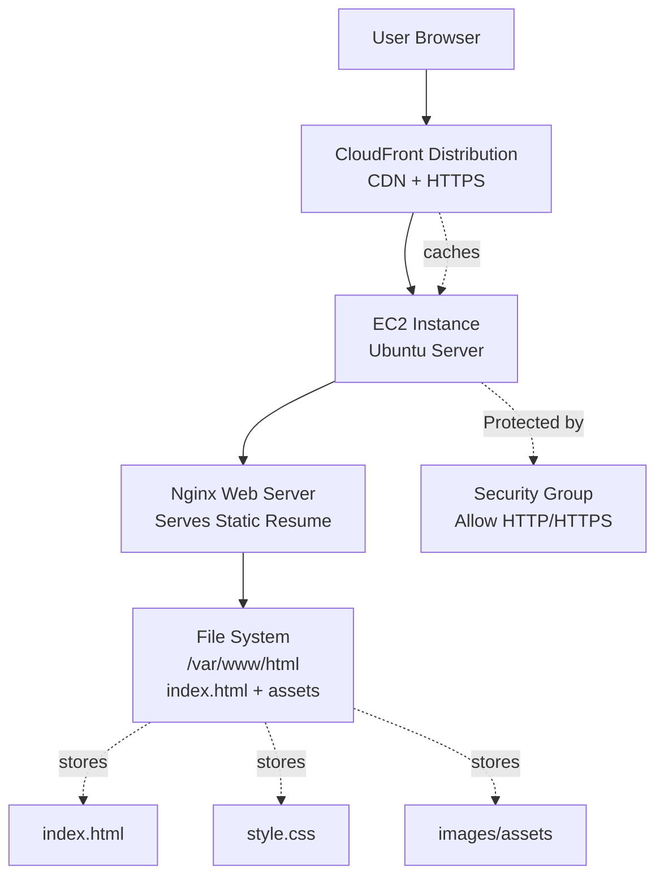

# AWS-Resume-Website-Deployment-Using-EC2-Nginx-Cloudfront

## Project Overview
This project demonstrates hosting a personal resume website using AWS EC2 with Nginx as a web server and CloudFront for secure global content delivery (HTTPS + CDN optimization).

## Tech Stack
- AWS EC2 (Amazon Linux)
- Nginx Web Server
- AWS CloudFront (CDN)
- HTML, CSS (Static Resume Website)

## Architecture



## ⚙️ Features
- Deployed static resume website on EC2
- Configured Nginx for serving static files
- Enabled HTTPS access via CloudFront
- Optimized global content delivery using CDN
- Secure and scalable hosting setup

## 📂 Deployment Steps
1. Launch EC2 instance (Ubuntu)
2. Install Nginx:
   ```bash
   sudo apt update
   sudo apt install nginx -y
